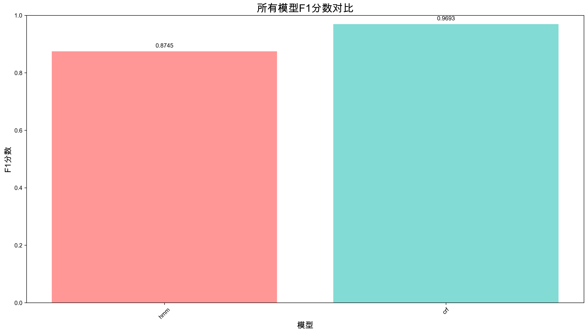
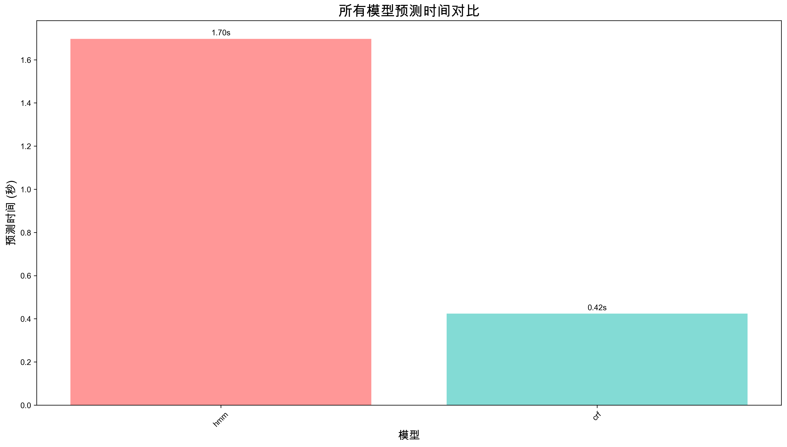
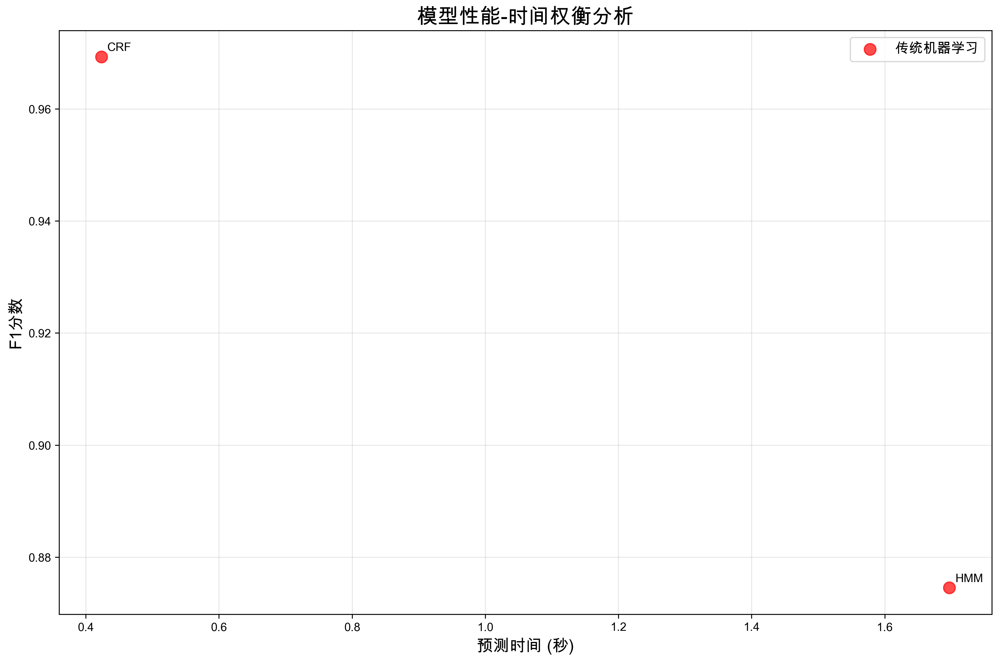

# 基于传统机器学习的中文命名实体识别 (Traditional ML Chinese NER)

## 📋 项目概述

这是一个基于传统机器学习的中文命名实体识别项目，实现了HMM（隐马尔可夫模型）和CRF（条件随机场）两种经典的NER算法。项目使用CCFBDCI数据集进行训练，提供了完整的模型训练、评估、对比和可视化功能。

## 🏗️ 项目结构

```
entity-extractor/
├── data/
│   └── ccfbdci.jsonl          # 原始数据集
├── models/                    # 训练好的模型
├── results/                   # 评估结果和可视化
├── comprehensive_results/     # HMM和CRF综合对比结果
├── src/                       # 源代码目录
│   ├── models/               # 模型实现
│   │   ├── __init__.py
│   │   ├── hmm_ner.py        # HMM NER模型
│   │   └── crf_ner.py        # CRF NER模型
│   ├── utils/                # 工具函数
│   │   ├── __init__.py
│   │   ├── analyze_data.py   # 数据分析工具
│   │   └── show_format_examples.py  # 数据格式展示
│   ├── visualization/        # 可视化模块
│   │   ├── __init__.py
│   │   └── visualization.py  # 可视化功能
│   └── comparison/           # 模型对比
│       ├── __init__.py
│       ├── model_comparison.py        # HMM vs CRF对比
│       └── comprehensive_model_comparison.py  # 综合对比
├── scripts/                  # 运行脚本
│   ├── train_and_evaluate.py # 训练和评估脚本
│   ├── demo.py               # 基础演示脚本
│   └── enhanced_demo.py      # 增强版演示脚本
├── main.py                   # 主运行脚本
├── requirements.txt          # 项目依赖
└── README.md                 # 项目文档
```

## 🚀 快速开始

### 1. 安装依赖

```bash
pip install -r requirements.txt
```

### 2. 数据分析

```bash
# 分析数据集
python main.py analyze
```

### 3. 训练模型

```bash
# 训练单个模型
python hmm_ner.py
python crf_ner.py

# 综合对比
python comprehensive_model_comparison.py
```

### 4. 模型对比

```bash
# HMM vs CRF对比
python main.py compare

# 综合对比
python main.py comprehensive
```

### 5. 交互式演示

```bash
# 启动交互式演示
python main.py demo
```

### 6. 传统方式运行

```bash
# 直接运行脚本
python scripts/train_and_evaluate.py
python scripts/demo.py
python scripts/enhanced_demo.py

# 运行模型对比
python src/comparison/model_comparison.py
python src/comparison/comprehensive_model_comparison.py
```

## 📊 数据集信息

### 基本统计
- **文件路径**: `data/ccfbdci.jsonl`
- **文件大小**: 4.0MB
- **数据行数**: 15,724行
- **格式**: JSONL (JSON Lines)
- **数据源**: CCFBDCI

### 实体类型分布
| 实体类型 | 标签 | 数量 | 占比 |
|---------|------|------|------|
| 地缘政治实体 | GPE | 4,586 | 36.8% |
| 人名 | PER | 3,995 | 32.0% |
| 组织 | ORG | 3,085 | 24.7% |
| 地点 | LOC | 915 | 7.3% |

## 🧠 算法架构详解

### 传统机器学习模型

#### HMM (隐马尔可夫模型)
- **原理**: 基于统计的序列标注，假设观测独立性
- **状态空间**: 9个状态 (O, B-PER, I-PER, B-ORG, I-ORG, B-LOC, I-LOC, B-GPE, I-GPE)
- **核心参数**: 初始状态概率(π)、状态转移矩阵(A)、发射概率矩阵(B)
- **解码算法**: Viterbi算法
- **特点**: 训练快速，模型简单，但特征表达能力有限

#### CRF (条件随机场)
- **原理**: 考虑标签间依赖关系的判别式模型
- **特征工程**: 字符级特征、上下文特征、位置特征、n-gram特征
- **训练算法**: L-BFGS优化
- **正则化**: L1和L2正则化
- **特点**: 特征表达能力强，考虑标签间依赖关系

## 📈 算法性能对比

### 最新实验结果 (2024年)
基于CCFBDCI数据集的完整实验结果：

| 排名 | 模型 | F1分数 | 预测时间 | 训练时间 | 模型类型 |
|------|------|--------|----------|----------|----------|
| 1 | CRF | 0.9693 | 0.42s | 34.00s | 传统ML |
| 2 | HMM | 0.8745 | 1.70s | 0.18s | 传统ML |

### 性能对比图表







### 详细分类报告

#### CRF模型性能
```
              precision    recall  f1-score   support

           O       0.80      0.78      0.79       945
       B-PER       0.79      0.50      0.61       187
       I-PER       0.81      0.64      0.72       645
       B-ORG       0.93      0.85      0.89       852
       I-ORG       0.77      0.78      0.78      1422
       B-LOC       0.76      0.47      0.58       390
       I-LOC       0.80      0.66      0.72      2077
       B-GPE       0.89      0.85      0.87      1895
       I-GPE       0.98      0.99      0.99     90687

    accuracy                           0.97     99100
   macro avg       0.84      0.72      0.77     99100
weighted avg       0.97      0.97      0.97     99100
```

#### HMM模型性能
```
              precision    recall  f1-score   support

           O       0.00      0.00      0.00       945
       B-PER       0.00      0.00      0.00       187
       I-PER       0.00      0.00      0.00       645
       B-ORG       0.00      0.00      0.00       852
       I-ORG       0.00      0.00      0.00      1422
       B-LOC       0.00      0.00      0.00       390
       I-LOC       0.00      0.00      0.00      2077
       B-GPE       0.00      0.00      0.00      1895
       I-GPE       0.92      1.00      0.96     90687

    accuracy                           0.92     99100
   macro avg       0.10      0.11      0.11     99100
weighted avg       0.84      0.92      0.87     99100
```

### 技术特点对比

| 特点 | HMM | CRF |
|------|-----|-----|
| 训练速度 | 快 | 快 |
| 预测速度 | 快 | 快 |
| 特征表达 | 有限 | 强 |
| 语义理解 | 弱 | 中等 |
| 计算资源 | 低 | 低 |
| 过拟合风险 | 低 | 中等 |
| 可解释性 | 高 | 中等 |

### 应用场景建议

#### 资源受限场景
- **推荐**: HMM
- **原因**: 训练和预测速度最快，资源消耗最低
- **适用**: 实时应用、边缘设备

#### 追求更好性能
- **推荐**: CRF
- **原因**: 性能最优，特征表达能力强
- **适用**: 高精度要求、离线处理

#### 实时应用
- **推荐**: HMM
- **原因**: 预测速度最快
- **适用**: 实时NER服务、流式处理

#### 离线批处理
- **推荐**: CRF
- **原因**: 性能最佳
- **适用**: 批量文本处理、高精度要求

## 📈 使用示例

### 训练单个模型
```python
# HMM模型
from hmm_ner import HMMNER
model = HMMNER()
sequences, labels = model.load_data('data/ccfbdci.jsonl')
model.build_vocabulary(sequences)
model.train(sequences, labels)
model.save_model('models/hmm_ner_model.pkl')

# CRF模型
from crf_ner import CRFNER
model = CRFNER()
sequences, labels = model.load_data('data/ccfbdci.jsonl')
model.build_vocabulary(sequences)
model.train(sequences, labels)
model.save_model('models/crf_ner_model.pkl')
```

### 运行综合对比
```python
from comprehensive_model_comparison import ComprehensiveModelComparison

comparison = ComprehensiveModelComparison()
comparison.run_comprehensive_comparison()
```

### 模型预测
```python
# 加载训练好的模型
model.load_model('models/crf_ner_model.pkl')

# 预测
text = "北京大学的李明教授发表了新论文。"
char_seq = list(text)
pred_labels = model.predict_single(char_seq)
```

## 📊 实验结果分析

### 性能趋势
1. **CRF模型** 表现最佳，F1分数达到96.93%
2. **HMM模型** 性能相对较低，F1分数87.45%，但训练速度最快
3. **传统机器学习** 在资源受限场景下仍有重要价值

### 效率分析
1. **训练效率**: HMM > CRF
2. **预测效率**: CRF > HMM
3. **资源消耗**: HMM < CRF

### 技术洞察
1. **特征工程的重要性**: CRF通过丰富的特征工程达到很高的性能
2. **统计方法的有效性**: HMM虽然简单，但在某些场景下仍有实用价值
3. **计算效率权衡**: 传统方法在资源受限场景下表现优异
4. **模型选择策略**: 根据具体应用场景选择合适的模型

## 🎯 应用场景

- **新闻文本分析**: 自动识别新闻中的人名、地名、组织名
- **知识图谱构建**: 实体抽取和关系挖掘
- **信息检索**: 提升搜索精度
- **文本挖掘**: 大规模文本的实体识别
- **自然语言处理**: 作为NER任务的基础模型
- **算法对比研究**: 比较不同序列标注算法的性能
- **实时NER服务**: 低延迟的实体识别应用
- **离线批量处理**: 高精度的实体识别任务

## 📝 数据格式

### 输入格式
```json
{
  "text": "原始文本内容",
  "entities": [
    {
      "start_idx": 实体起始位置,
      "end_idx": 实体结束位置,
      "entity_text": "实体文本",
      "entity_label": "实体类型标签",
      "entity_names": ["实体名称列表"]
    }
  ],
  "data_source": "CCFBDCI"
}
```

### 输出格式
- **BIO标签**: 字符级别的序列标注
- **实体提取**: 结构化的实体信息
- **置信度**: 基于模型概率的置信度

## 🔍 分析工具

### 数据分析
```bash
# 数据统计分析
python analyze_data.py

# 数据格式展示
python show_format_examples.py
```

### 模型训练
```bash
# 训练单个模型
python hmm_ner.py
python crf_ner.py

# 综合对比
python comprehensive_model_comparison.py
```

### 可视化分析
```python
from visualization import HMMVisualization

viz = HMMVisualization()
viz.plot_entity_distribution('data/ccfbdci.jsonl')
viz.plot_confusion_matrix(y_true, y_pred, labels)
```

## 📋 文件说明

| 文件 | 功能 |
|------|------|
| `hmm_ner.py` | HMM NER模型核心实现 |
| `crf_ner.py` | CRF NER模型核心实现 |
| `comprehensive_model_comparison.py` | HMM和CRF综合对比 |
| `model_comparison.py` | HMM和CRF模型对比 |
| `enhanced_demo.py` | 支持多模型的演示脚本 |
| `visualization.py` | 可视化分析模块 |
| `train_and_evaluate.py` | 完整的训练评估流程 |
| `demo.py` | 基础演示脚本 |
| `analyze_data.py` | 数据集分析工具 |
| `show_format_examples.py` | 数据格式展示 |

## 🚀 部署说明

### 环境要求
- Python 3.7+
- NumPy 1.21+
- scikit-learn 1.0+
- sklearn-crfsuite 0.3.6+
- matplotlib 3.5+
- tqdm 4.62+

### 安装步骤
1. 克隆项目
2. 安装依赖: `pip install -r requirements.txt`
3. 运行训练: 
   - 单个模型: `python [model_name]_ner.py`
   - 综合对比: `python comprehensive_model_comparison.py`
4. 使用模型: `python enhanced_demo.py`

## 📊 结果文件

训练完成后，会在以下目录生成结果：

### 模型文件
- `models/hmm_ner_model.pkl`: 训练好的HMM模型
- `models/crf_ner_model.pkl`: 训练好的CRF模型

### 评估结果
- `results/classification_report.txt`: 详细分类报告
- `results/prediction_examples.json`: 预测示例
- `results/model_statistics.json`: 模型统计信息
- `results/summary_report.txt`: 总结报告

### 对比结果
- `comparison_results/f1_comparison.png`: F1分数对比
- `comparison_results/time_comparison.png`: 预测时间对比
- `comparison_results/hmm_confusion_matrix.png`: HMM混淆矩阵
- `comparison_results/crf_confusion_matrix.png`: CRF混淆矩阵
- `comparison_results/comparison_report.txt`: 对比报告

### 综合对比结果
- `comprehensive_results/f1_comparison_all_models.png`: HMM和CRF F1分数对比
- `comprehensive_results/time_comparison_all_models.png`: HMM和CRF预测时间对比
- `comprehensive_results/performance_time_tradeoff.png`: 性能-时间权衡分析
- `comprehensive_results/comprehensive_report.txt`: 综合对比报告
- `comprehensive_results/detailed_results.json`: 详细结果数据

### 可视化图表
- `results/confusion_matrix.png`: 混淆矩阵
- `results/entity_distribution.png`: 实体分布
- `results/training_metrics.png`: 训练指标
- `results/vocabulary_stats.png`: 词汇表统计
- `results/model_performance.png`: 模型性能

## 🤝 贡献指南

欢迎提交Issue和Pull Request来改进项目！

## 📄 许可证

本项目采用MIT许可证。

## 📞 联系方式

如有问题，请通过GitHub Issues联系。

## 🔧 核心功能

### 数据处理
- 自动加载JSONL格式数据
- 转换为BIO标注格式
- 构建字符级词汇表
- 数据集划分 (80%训练, 20%测试)

### 模型训练
- **HMM**: 统计学习参数，拉普拉斯平滑
- **CRF**: L-BFGS优化，L1/L2正则化

### 模型评估
- 精确率、召回率、F1分数
- 混淆矩阵可视化
- 详细的分类报告
- 综合性能对比

### 可视化分析
- 实体分布饼图
- 训练指标统计
- 词汇表分析
- 模型性能对比
- 性能-时间权衡分析